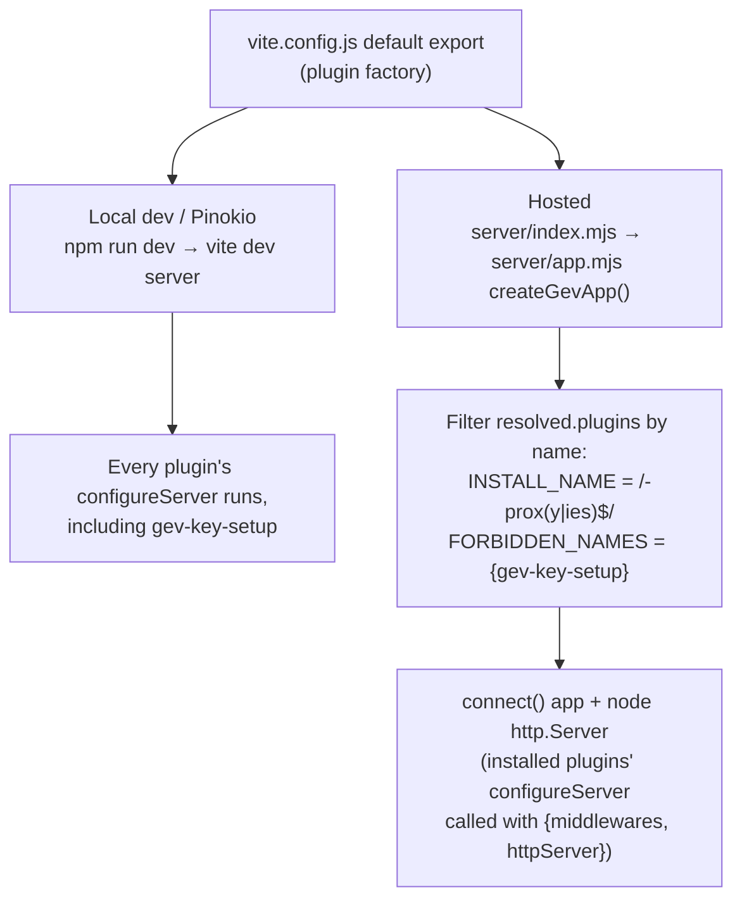
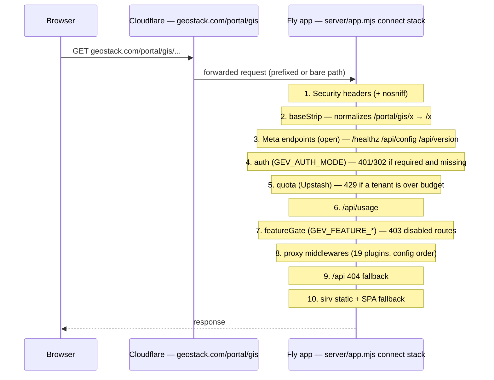
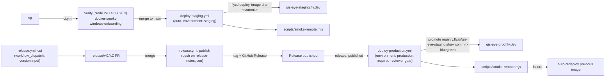

# Architecture (AGI hosted GIS-EYE)

Orientation for a new engineer or a new Claude session. This is the "how it
fits together" doc; `docs/CURRENT-STATE.md` is the authoritative runtime
reference for feature-level behavior, and `docs/agi/DEPLOY.md`,
`RELEASING.md`, `UPSTREAM-SYNC.md`, `REPO-SETTINGS.md` cover their topics in
depth. Everything below is verified against code at commit `4f9c85d`; file
references are relative to the repo root.

## 1. Two runtimes, one codebase

Upstream ships a single runtime: `vite dev` for local development. The fork
adds a production server **without forking the app logic** — both runtimes
install plugins from the same factory, `vite.config.js`'s default export
(`export default defineConfig(({ mode }) => {...})`, vite.config.js:7732).
Its `plugins` array (vite.config.js:7746-7768) is, in registration order:
`cesium()`, `gevRuntimeMeta()`, 19 API-proxy plugins whose names end in
`-proxy`/`-proxies` (opensky, celestrak, tomtom, firms, rocket-launches,
terrain-heights, adsbdb, overpass, military-installations, regional-brief,
weather-effects, cctv, radio-browser, gbfs, adsblol, ais-live,
track-backfill [pair], openai-realtime, google-places-context), and
`keySetupEndpoint()` (plugin name `gev-key-setup`, vite.config.js:7636).

- **Local dev / Pinokio launcher** (`npm run dev`, `scripts/dev-fresh.sh`,
  etc.): the Vite dev server itself calls every plugin's `configureServer`,
  so all ~20 plugins install, including `gev-key-setup` — the Provider
  Settings endpoints (`/api/setup/status`, `/api/setup/keys`) that write the
  repo's `.env` file. That plugin pins `apply: (_config, {command,
  isPreview}) => command === 'serve' && !isPreview` (vite.config.js:7638),
  so it's absent under `vite preview` too, not only under a production
  build — a credential-write surface has no reason to exist outside the dev
  server.
- **Hosted** (`server/index.mjs` → `Dockerfile` → Fly): `createGevApp()`
  (server/app.mjs:69-156) imports `vite.config.js`, calls the factory with
  `{mode: env.NODE_ENV || 'production', command: 'serve'}` (app.mjs:74-76),
  and replays plugin installation itself onto a plain `connect()` app plus a
  Node `http.Server` — every proxy plugin's `configureServer` only needs
  `{middlewares, httpServer}`, so this "duck-typed" server is a complete
  host (app.mjs:62-67). It **allowlists by name**: `INSTALL_NAME =
  /-prox(y|ies)$/` and `FORBIDDEN_NAMES = new Set(['gev-key-setup'])`
  (app.mjs:27-28), applied in the loop at app.mjs:114-130. Two plugins are
  skipped by construction:
  - `vite-plugin-cesium` (name `cesium`, no `-proxy` suffix) — a build-time
    asset plugin with no server route to serve.
  - `gev-key-setup` — explicitly forbidden even though (in dev) its name
    doesn't match `-proxy` either; the explicit set makes the exclusion a
    named invariant rather than an accident of naming.
  - `gev-runtime-meta` (server/mw/meta.mjs) also doesn't match the `-proxy`
    suffix, but it is **not** subject to this filter — it's installed
    directly and separately, ahead of auth (see §2).
  - The boot log prints both `installed` and `skipped` plugin names
    (server/index.mjs:24-25), and `server/app.test.mjs:52` asserts the full
    installed set and that `gev-key-setup` is always in `skipped`.

## 2. Request path for a hosted user

Verified against `server/app.mjs`'s literal `app.use(...)` call order
(app.mjs:87-153):

1. **Security headers** (app.mjs:87-92) — the same document headers the dev
   server sets (`X-Frame-Options: DENY`, `Content-Security-Policy:
   frame-ancestors 'none'`, read from the resolved Vite config so upstream
   changes carry over) plus `X-Content-Type-Options: nosniff`. This runs
   **before** `baseStrip`, so it applies uniformly regardless of path form.
2. **`baseStrip(base)`** (app.mjs:45-60, mounted at 94) — makes prefixed
   (`/portal/gis/api/x`) and bare (`/api/x`) URLs behave identically: a bare
   deployment-root hit (`/portal/gis`) 302s to `/portal/gis/`; anything
   starting with the base has the prefix stripped from `req.url` before
   every downstream middleware sees it. This tolerates a Cloudflare rule
   that forwards the full path or one that strips it.
3. **Meta endpoints** (server/mw/meta.mjs, installed directly at
   app.mjs:98, *not* through the generic proxy-plugin filter): `GET
   /healthz`, `GET /api/config`, `GET /api/version`. Mounted ahead of auth
   deliberately — health checks and the boot-time config the client needs
   before any sign-in bounce must stay reachable unauthenticated.
4. **`authMiddleware(env)`** (server/lib/auth.mjs, mounted at app.mjs:102)
   — a no-op passthrough when `GEV_AUTH_MODE=none` (the default). In
   `hs256`/`jwks` mode it verifies a JWT from the `gev_session` cookie or a
   `Bearer` header; `/healthz` always stays open; an unauthenticated `/api/*`
   call gets 401 with the login URL, an unauthenticated HTML GET 302s to
   `GEV_LOGIN_URL`.
5. **`quotaMiddleware(quotaStore)`** (server/lib/quota.mjs, app.mjs:103-104)
   — a no-op when `UPSTASH_REDIS_REST_URL`/`_TOKEN` aren't set. Otherwise
   enforces `GEV_QUOTA_{OPENAI,GOOGLE,TOMTOM}_{PER_MIN,PER_DAY}` per tenant
   (SSO org → sub → edge IP) via atomic fixed windows in Upstash Redis,
   shared across blue/green machines; fails **open** with one logged warning
   on store failure.
6. **`GET /api/usage`** (app.mjs:105-110) — reports the caller's current
   counters via `quotaStore.usage()`.
7. **`featureGate(features)`** (server/lib/features.mjs:50-70, mounted at
   app.mjs:112) — 403s any request under a disabled feature's route
   prefixes (only `opensky` has server routes today: `/api/opensky*`;
   `cables`/`datacenters`/`dams` are client-only gates, see §8).
8. **Proxy middlewares** — the 19 `-proxy`/`-proxies` plugins, installed in
   the order they appear in `vite.config.js`'s `plugins` array (app.mjs
   loop at 114-130).
9. **`/api` 404** (app.mjs:133) — any `/api/*` path no proxy claimed is a
   sanitized JSON 404, never the SPA fallback (this is what
   `scripts/smoke-api.mjs` uses to prove every route is actually mounted).
10. **`sirv` static + SPA fallback** (app.mjs:135-153) — immutable
    1-year cache for `/assets/*`, no-cache for HTML, `single: true` so any
    unmatched non-API path serves `index.html`. If no `dist/` build is
    present, the server answers 503 instead (`hasDist` check).

## 3. Client boot sequence (`src/main.js`)

Verified call order in `init()` (src/main.js:75-361), plus the
module-top-level call before it:

1. `initLogoGaze()` — module top level (main.js:42), before `init()` runs.
2. `loadRuntimeConfig()` fired **without awaiting** (main.js:81) — the
   `/api/config` fetch overlaps viewer startup; it fails open to
   all-features-enabled on any error (src/runtimeConfig.js:22,52,62).
3. `runStateMigrations()` (main.js:85) — must run before anything reads
   localStorage.
4. `initTheme()` (main.js:89) — re-applies the theme through the durable
   API; the flash is already prevented by an inline `<head>` script in
   `index.html` (see §7).
5. Cesium `Viewer` construction, credits registration, sky/atmosphere
   tuning, photorealistic tileset load (`await`ed) (main.js:101-186).
6. `MapStackController` created and `setStack()` awaited (main.js:190-204).
7. `StyleManager` constructed (main.js:207) — synchronously parses the
   share hash and sets `hasShareState`; `flyToAustin()` runs only when
   `!styleManager.hasShareState` (main.js:215-220) — this is just the
   loading-screen status text branch, not the actual restore.
8. `DataLayerManager` constructed and every layer `register()`ed
   (main.js:223-242).
9. `installFeatureGate(dataManager, await runtimeConfigPromise)`
   (main.js:245) — **here** the config promise from step 2 is finally
   awaited, and the visibility guard vetoing license-gated layers is
   installed before restoration can begin.
10. `dataManager.finalizeRegistrations(LAYER_STATE_REGISTRY)` (main.js:247)
    — the layer registry is sealed; restoration may start only now.
11. `dataManager.buildTogglePanel(...)`, then
    `styleManager.attachDataManager(dataManager)` (main.js:258-259) — this
    is what actually starts share-link layer/camera/panel restoration.
12. `SceneDirector`, voice annotations initialized (main.js:262-265).
13. `Promise.all([styleManager.initialRestorePromise, 1000ms timer])` →
    hide the loading screen → first-run experience reveal (main.js:269-287)
    — startup chrome stays up until camera, visual/map/panel lanes, and
    every requested layer have terminated.
14. `initKeySetup()` fire-and-forget (main.js:292) — removes its own chip
    and dialog when `/api/setup/status` is unreachable (prod builds, LAN
    visitors), so it costs a hosted deployment nothing.
15. `initUpdateToast()` (main.js:296).
16. Render governor, scope mask, tracked-entity render holds, tab-visibility
    render suspension, `window.__godsEyeView` debug handle, voice commands
    (main.js:302-352).

## 4. Base-path model

Hosted deployments serve the app under a path prefix (e.g.
`geostack.com/portal/gis`), so same-origin requests can't hardcode
root-absolute paths.

- **`GEV_BASE`** (e.g. `/portal/gis/`) is the single source of truth, read
  in two places:
  - `vite.config.js`: `base: env.GEV_BASE || '/'` (vite.config.js:7745) —
    Vite rewrites static asset URLs in the built `index.html` at build time.
  - `server/app.mjs`: `normalizeBase(env.GEV_BASE)` (app.mjs:31-37, used at
    78) canonicalizes it to `/prefix/` form (`/` when unset), and
    `baseStrip(base)` (app.mjs:45-60) makes the server accept both prefixed
    and bare URLs (§2).
- **`src/basePath.js`**: `BASE_PATH` is derived from Vite's injected
  `import.meta.env.BASE_URL` (basePath.js:15-18; `''` when served at root).
  `withBase(path)` prefixes any root-absolute app path; `apiUrl(path)` is
  today an alias of `withBase` (basePath.js:29-31), reserved as the seam for
  request-level auth policy. Every client `/api/*` fetch and runtime-read
  asset attribute must go through one of these — a raw `/api/x` string
  breaks under a non-root `GEV_BASE`.
- Under `npm run dev`, the Pinokio launcher, and Node-based unit tests the
  base is `/`, so `withBase`/`apiUrl` are no-ops.

## 5. Deploy pipeline

> **Under revision**: another lane is concurrently hardening these
> workflows. What follows describes `main` @ `4f9c85d`'s actual behavior,
> verified against `.github/workflows/*.yml`.

- **CI** (`ci.yml`): on every PR, push to `main`, and manual dispatch.
  `verify` runs on a `[24.14.0, 26.x]` Node matrix — `npm ci`, `npm run
  doctor -- --json`, `npm test`, `npm run build`. `docker-smoke` builds the
  production image and curls `/healthz`, `/api/config`, `/`, and confirms
  `/api/setup/status` is 404 (the dev-only endpoint must be absent from the
  image). `windows-onboarding` runs the Pinokio install path and a focused
  test subset on `windows-latest`.
- **`deploy-staging.yml`**: triggers on push to `main` (queues rather than
  cancels concurrent runs). Builds and deploys an image labeled
  `sha-<commit>` via `flyctl deploy -c fly.staging.toml --remote-only`, with
  `--build-arg GEV_BASE=/portal/gis/ --build-arg GIT_SHA=<sha>` plus the two
  client-exposed keys; then `node scripts/smoke-remote.mjs
  https://gis-eye-staging.fly.dev/portal/gis/`.
- **`release.yml`** — two jobs:
  - `cut` (manual dispatch with a `version` input): runs
    `scripts/release-notes.mjs --version <x.y.z>` (cuts CHANGELOG's
    `[Unreleased]` into a version section) and opens a `release/vX.Y.Z` PR.
  - `publish` (triggers on push to `main` touching `release-notes.json`,
    i.e. when that PR merges): tags `vX.Y.Z` and publishes a GitHub Release
    from the cut notes. **Publishing the release is what triggers
    `deploy-production.yml`.**
- **`deploy-production.yml`**: triggers on `release: published` or manual
  dispatch (with an `image` input for hotfix/rollback). Gated by the
  `production` GitHub environment's required-reviewer approval. Resolves
  the image to deploy as the dispatch input, or
  `registry.fly.io/gis-eye-staging:sha-<release commit>` — **promoting the
  exact image staging already validated, no rebuild**. Captures the
  currently-running prod image via `flyctl image show` first. Deploys with
  `flyctl deploy -c fly.production.toml --image <ref>` (blue/green strategy
  is set in `fly.production.toml`'s `[deploy] strategy = "bluegreen"`, not
  in the workflow). Runs the same remote smoke test against
  `gis-eye-prod.fly.dev`; **on smoke failure, automatically redeploys the
  previous image** captured earlier.
- **Token sourcing**: both deploy workflows read
  `secrets.FLY_DEPLOY_TOKEN_{STAGING,PRODUCTION} || secrets.FLY_API_TOKEN`
  — the minted token wins when present, a hand-set environment secret is
  the fallback. See root `CLAUDE.md` for how to mint/rotate these via
  `infra-admin`'s `mint-token.yml`/`rotate-token.yml`; Stripe keys have no
  minting API and stay a human step.

## 6. Update toast + state preservation contract

`src/updateToast.js` polls `GET /api/version` (server/mw/meta.mjs) every 10
minutes plus on tab focus/visibility change (min 60s gap between checks,
updateToast.js:20-21,178-184). The first successful read becomes the
`baseline` build identity (`sha || builtAt || version`,
updateToast.js:26-29); a later read with a different identity shows the
toast. "Later" snoozes that specific identity in `sessionStorage`
(`gev:update-toast-snooze`) so it doesn't re-appear this tab session.
"Update now" dispatches a `gev:before-update` window event, giving state
holders one synchronous chance to flush, then reloads.

**What persists, and where:**

| Store | Contents | Source |
|---|---|---|
| URL hash | camera (lat/lon/alt/heading/pitch), active style + params, bloom/sharpen, HUD mode, panel visibility/position, layer state, map stack, created-at — "the live view" | `src/sharelink.js`; `sharelink.js`'s `gev:before-update` listener (line 156) flushes any debounced hash write before reload |
| `localStorage` | scene projects (`godsEyeView.sceneProject.v2`), layer enablement/params (`gev:layer-state:v2`), panel layout (`godsEyeView.v*.panelPos.*`/`panelCollapsed.*`), CCTV calibration (`godsEyeView.cctv.calibration.v2`), voice spend tier (`godsEyeView.voiceCost.*`), first-run/detection-allocation flags, theme choice (`gev:theme:v1`), the migrations ledger (`gev:migrations:v1`) | full inventory documented in `src/stateMigrations.js`:11-19 |
| `sessionStorage` | update-toast snooze only | `src/updateToast.js` |

**`stateMigrations.js` rule** (CONTRIBUTING.md rule 5): whenever a
`*_STORAGE_VERSION` constant or a `:vN`-suffixed localStorage key bumps, add
an entry to the `MIGRATIONS` array (`{id, run(storage)}`, must be
idempotent) that carries the old value forward, or note an explicit reset in
the CHANGELOG entry — this is what makes the update toast's "nothing will be
lost" promise true. `runStateMigrations()` records completed ids in the
`gev:migrations:v1` ledger so each migration runs exactly once; a failed
migration never blocks boot and is retried next load
(stateMigrations.js:44-51). As of `4f9c85d`, `MIGRATIONS` is an empty array
— no storage-shape change has shipped yet that needed one.

## 7. Theming model

> Another lane is migrating remaining hardcoded color literals in
> `style.css` into `--gs-*`-derived tokens; `style.css` still has roughly
> 200+ raw hex-color occurrences outside the tokenized `:root` block as of
> this writing. The globe canvas, GLSL visual styles, and data-semantic
> colors (aircraft/vessel classes) are **deliberately not themed**
> (`src/theme/palette.css`:7-9, `docs/CURRENT-STATE.md`:38) — those are not
> migration targets.

1. **`src/theme/palette.css`** defines the swap-in `--gs-*` tokens: a dark
   default (`:root`, `:root[data-theme='dark']`, palette.css:17-29), a
   placeholder light palette (`:root[data-theme='light']`, palette.css:33-44,
   explicitly commented as "swap every value" once real GeoStack tokens
   exist), and a `prefers-color-scheme: light` media block that mirrors the
   light values when no explicit `data-theme` is set (palette.css:47-60).
2. **`style.css`**'s `:root` block derives its own working variables
   (`--bg-dark`, `--glass-bg`, `--glass-border`, `--glass-border-hover`,
   `--accent`, `--accent-dim`, `--accent-glow`, `--text-primary`,
   `--text-secondary`, `--text-dim`) from the `--gs-*` tokens via
   `var(--gs-X, <original-dark-value>)` (style.css:6-19) — the fallback is
   always the original dark value, so an unthemed build still renders
   correctly.
3. **`src/theme/themeController.js`**'s `initTheme()` sets `data-theme` on
   `<html>`. Precedence (themeController.js:16-27): explicit `?theme=` query
   param (portal handoff link) → `gs_theme` cookie (portal-set, same-origin
   under `/portal/gis`) → saved choice (`gev:theme:v1` in `localStorage`) →
   `prefers-color-scheme`, defaulting to dark. An inline, dependency-free
   copy of this exact precedence runs in `index.html`'s `<head>`
   (index.html:8-24) before stylesheets load, to avoid a flash of the wrong
   theme; `initTheme()` in `main.js` step 4 (§3) re-applies it through the
   durable API and persists a `?theme=` handoff to `localStorage`.

## 8. License-gated features and why

`DATA_SOURCES.md` is the source of truth: the MIT grant covers this
repo's **code**, not third-party data — every bundled or live source keeps
its own license, and non-permissive ones are carved out rather than hidden
(DATA_SOURCES.md:3,7-10). Two sources are commercially restrictive enough to
gate on hosted deployments:

- **OpenSky Network** (live flights) — non-commercial research/education
  license; operational REST use in a live product can require a prior
  written agreement even for non-profit/government use
  (DATA_SOURCES.md:19,44). Gated by `GEV_FEATURE_OPENSKY`
  (server/lib/features.mjs:17) with a real **server-side** route block
  (`/api/opensky*` → 403 via `featureGate`, §2 step 7) plus a **client-side**
  veto of the `flights` layer (`src/runtimeConfig.js`
  `FEATURE_LAYER_IDS.opensky`).
- **TeleGeography submarine cables** (bundled static dataset) — CC
  BY-NC-SA 3.0, NonCommercial (DATA_SOURCES.md:65,69-75). Gated by
  `GEV_FEATURE_CABLES` (features.mjs:20); this one is **client-only** (no
  server route — it's a bundled file, not a live proxy), vetoing the
  `telegeography-submarine-cables` layer.

Both flags are explicitly set to `0` in **both** `fly.staging.toml` and
`fly.production.toml`. `GEV_FEATURE_DATACENTERS`/`GEV_FEATURE_DAMS` also
exist in `features.mjs` (lines 21-22) as available per-deployment controls,
but their underlying data is ODbL 1.0 (OSM-derived), which permits
commercial use with attribution + share-alike (DATA_SOURCES.md:63-64,77-79)
— neither `fly.*.toml` sets them, so they ship **enabled** on hosted
deploys today, unlike OpenSky/Cables.

Every feature defaults to **on** (features.mjs:9-12) so `npm run dev` and
the Pinokio launcher always show the full upstream experience; only the
hosted `fly.*.toml` env files turn anything off. Enforcement is defense in
depth: the server refuses the API route (where one exists) *and* the client
independently hides the toggle row and force-disables the layer
(`installFeatureGate`, `src/runtimeConfig.js`:91-126) — called at
`main.js`:245, before layer registration is sealed, so neither a user toggle
nor a restored share link can re-enable a gated layer client-side.

## 9. Upstream relationship

This is a fork of the active upstream project
[`bilawalsidhu/gods-eye-view`](https://github.com/bilawalsidhu/gods-eye-view)
(`docs/agi/UPSTREAM-SYNC.md`:3-4); sync monthly via `git merge` (never
rebase) into a PR. Invariants every sync must re-check
(UPSTREAM-SYNC.md:20-45):

1. `vite.config.js` stays upstream-shaped except three fork hunks: the
   `./server/mw/meta.mjs` import + `gevRuntimeMeta()` plugin-array entry,
   and `base: env.GEV_BASE || '/'`.
2. Any new upstream proxy plugin must be named with a `-proxy`/`-proxies`
   suffix to be served in production — `server/app.mjs`'s `INSTALL_NAME`
   regex is how it gets installed (§1); `server/app.test.mjs` covers this.
3. `gev-key-setup` must stay out of the production-installed set
   (`FORBIDDEN_NAMES`) — also covered by `server/app.test.mjs`.
4. Every client `/api/*` fetch must go through `apiUrl()`
   (`src/basePath.js`) — grep `'/api/` in `src/` after a sync and wrap any
   new upstream call sites.
5. `style.css`'s `:root` token-derivation block (§7) is a small fork edit;
   re-apply it if upstream rewrites that block.
6. **Fork-local, never merged from upstream**: `server/`, `Dockerfile`,
   `fly.*.toml`, `.github/workflows/deploy-*.yml`, `docs/agi/`, theming
   token files, `CODEOWNERS`, issue/PR templates, and `package.json`'s
   `repository`/`homepage`/`bugs` fields.

Post-merge gate: `npm ci && npm test && npm run build` before opening the PR
into `main`.

## 10. Where to change X

| Want to change... | Start here |
|---|---|
| Add/modify a proxy API route | `vite.config.js` — name the plugin `*-proxy`/`*-proxies` to auto-install in production (§1) |
| Add a data layer | `src/data/*.js`, then register it in `src/main.js` (§3 step 8) |
| License-gate a layer per deployment | `server/lib/features.mjs` (`FEATURES`), `src/runtimeConfig.js` (`FEATURE_LAYER_IDS`), `fly.*.toml` |
| Auth / SSO behavior | `server/lib/auth.mjs`; `GEV_AUTH_MODE`/`GEV_JWT_*` in `fly.*.toml` |
| Per-tenant quotas | `server/lib/quota.mjs`; `GEV_QUOTA_*` / `UPSTASH_REDIS_REST_*` |
| Health/config/version endpoints | `server/mw/meta.mjs` |
| Deployment base path | `GEV_BASE` env; `src/basePath.js`; `server/app.mjs` (`normalizeBase`/`baseStrip`) |
| Theming / colors | `src/theme/palette.css` (tokens); `style.css` `:root` (derived vars); `src/theme/themeController.js` (precedence); `index.html` head script (no-flash mirror) |
| Update toast copy/behavior | `src/updateToast.js`; `scripts/release-notes.mjs` and `CHANGELOG.md` `[Unreleased]` (notes content) |
| localStorage migrations | `src/stateMigrations.js` (`MIGRATIONS` array) — required by CONTRIBUTING.md rule 5 |
| Share-link encoding | `src/sharelink.js` |
| CI checks | `.github/workflows/ci.yml` |
| Staging deploy | `.github/workflows/deploy-staging.yml`, `fly.staging.toml` |
| Production deploy / release | `.github/workflows/release.yml`, `.github/workflows/deploy-production.yml`, `fly.production.toml`, `docs/agi/RELEASING.md` |
| Deploy tokens | `infra-admin`'s `mint-token.yml`/`rotate-token.yml` — see root `CLAUDE.md` |
| Data source license/attribution | `DATA_SOURCES.md` + `src/data/dataCredits.js` |
| Repo/branch/environment settings | `docs/agi/REPO-SETTINGS.md` |
| Client boot order | `src/main.js` |
